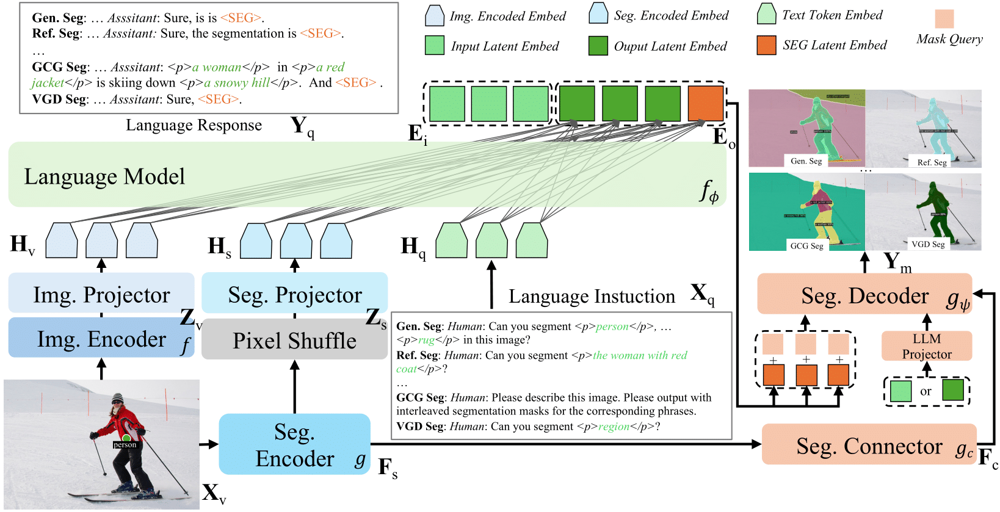

<div align="center">
<h1>✨X-SAM </h1>
<h3>From Segment Anything to Any Segmentation</h3>

[Hao Wang](https://github.com/wanghao9610)<sup>1,2</sup>,[Limeng Qiao](https://scholar.google.com/citations?user=3PFZAg0AAAAJ&hl=en)<sup>3</sup>,[Zequn Jie](https://scholar.google.com/citations?user=4sKGNB0AAAAJ&hl)<sup>3</sup>, [Zhijian Huang](https://zhijian11.github.io/)<sup>1</sup>, [Chengjian Feng](https://fcjian.github.io/)<sup>3</sup>, 

[Qingfang Zheng](https://openreview.net/profile?id=%7EZheng_Qingfang1)<sup>2</sup>, [Lin Ma](https://forestlinma.com/)<sup>3</sup>, [Xiangyuan Lan](https://scholar.google.com/citations?user=c3iwWRcAAAAJ&hl)<sup>2</sup><sup>:email:</sup>, [Xiaodan Liang](https://scholar.google.com/citations?user=voxznZAAAAAJ&hl)<sup>1</sup><sup>:email:</sup>

<sup>1</sup> Sun Yat-sen University, <sup>2</sup> Peng Cheng Laboratory, <sup>3</sup> Meituan Inc.

<sup>:email:</sup> Corresponding author
</div>

<div align="center" style="display: flex; justify-content: center; align-items: center;">
  <a href="https://arxiv.org/abs/2508.04655" style="margin: 0 2px;">
    
  </a>
  <a href='https://huggingface.co/hao9610/X-SAM' style="margin: 0 2px;">
    
  </a>
  <a href="https://github.com/wanghao9610/X-SAM" style="margin: 0 2px;">
    
  </a>
  <a href="http://47.115.200.157:7861" style="margin: 0 2px;">
    
  </a>
  <a href="http://121.43.252.12:7862" style="margin: 0 2px;">
    
  </a>
  <a href='https://wanghao9610.github.io/X-SAM/' style="margin: 0 2px;">
    
  </a>
</div>

## :eyes: Notice

X-SAM is under active development, and we will continue to update the code and documentation. Please check [TODO](#white_check_mark-todo) to get our development schedule.

We recommend that everyone use English to communicate in issues, as this helps developers from around the world discuss, share experiences, and answer questions together.

*If you have any questions or would like to collaborate, please feel free to open an issue or reach out to me at `wanghao9610@gmail.com`.*

## :boom: Updates

- **`2025-11-19`**: We release the code for [Training X-SAM](#stage-3-mixed-fine-tuning). Welcome to try it! If you have any questions, please feel free to open an issue.
- **`2025-11-08`**: Congratulations! 🎉🎉🎉 X-SAM has been accepted by AAAI 2026! We will release all the code in the coming week!
- **`2025-09-28`**: We update the [Local Demo](#local-demo) Inference script, you can run local inference instead of on the Web Demo.
- **`2025-08-11`**: Thanks for your great attention to our work! We have deployed another [Online Demo2](http://121.43.252.12:7862). You can also try it if [Online Demo1](http://47.115.200.157:7861) is not available.
- **`2025-08-11`**: We released the effective code for [Evaluation on All Segmentation Benchmarks](#evaluate-on-all-segmentation-benchmarks). We have updated all code except for [Training X-SAM](#stage-3-mixed-fine-tuning).
- **`2025-08-10`**: We released the detailed instructions for [Demo Deployment](#computer-demo).
- **`2025-08-09`**: We released the code for [Training LLaVA-based MLLMs](#llava).
- **`2025-08-08`**: We released the simple code for [Evaluation on All VLM Benchmarks](#evaluate-on-all-vlm-benchmarks).
- **`2025-08-06`**: We are excited to publish the [Technical Report](https://arxiv.org/pdf/2508.04655), please check it out for more technical details.
- **`2025-08-05`**: We provided the [Model Weights](https://huggingface.co/hao9610/X-SAM) on the HuggingFace🤗.
- **`2025-07-26`**: We deployed the [Online Demo](http://47.115.200.157:7861), you can try it now!

## :rocket: Introduction
This repository provides the official PyTorch implementation, pre-trained models, training, evaluation, visualization, and demo code of X-SAM:

* X-SAM introduces a unified multimodal large language model (MLLM) framework, extending the segmentation paradigm from *segment anything* to *any segmentation*, thereby enhancing pixel-level perceptual understanding.

* X-SAM proposes a novel Visual GrounDed (VGD) segmentation task, which segments all instance objects using interactive visual prompts, empowering the model with visually grounded, pixel-wise interpretative capabilities.

* X-SAM presents a unified training strategy that enables co-training across multiple datasets. Experimental results demonstrate that X-SAM achieves state-of-the-art performance on various image segmentation benchmarks, highlighting its efficiency in multimodal, pixel-level visual understanding.

:sparkles: **HIGHLIGHT**: This repository provides unified and effective code for training, evaluation, and visualization of segmentation MLLMs, including LLaVA-based MLLMs. We hope this repository will promote further research on MLLMs.

## :bookmark: Abstract

Large Language Models (LLMs) demonstrate strong capabilities in broad knowledge representation, yet they are inherently deficient in pixel-level perceptual understanding. Although the Segment Anything Model (SAM) represents a significant advancement in visual-prompt-driven image segmentation, it exhibits notable limitations in multi-mask prediction and category-specific segmentation tasks, and it cannot integrate all segmentation tasks within a unified model architecture. To address these limitations, we present X-SAM, a streamlined Multimodal Large Language Model (MLLM) framework that extends the segmentation paradigm from *segment anything* to *any segmentation*. Specifically, we introduce a novel unified framework that enables more advanced pixel-level perceptual comprehension for MLLMs. Furthermore, we propose a new segmentation task, termed Visual GrounDed (VGD) segmentation, which segments all instance objects with interactive visual prompts and empowers MLLMs with visual grounded, pixel-wise interpretative capabilities. To enable effective training on diverse data sources, we present a unified training strategy that supports co-training across multiple datasets. Experimental results demonstrate that X-SAM achieves state-of-the-art performance on a wide range of image segmentation benchmarks, highlighting its efficiency for multimodal, pixel-level visual understanding.

## :mag: Overview



## :bar_chart: Benchmarks

Please refer to the [Benchmark Results](docs/benchmark_results.md) for more details.

## :checkered_flag: Getting Started
### 1. Structure
We provide a detailed project structure for X-SAM. Please follow this structure to organize the project.

<details open>
<summary>📁 Structure (Click to collapse)</summary>

```bash
X-SAM
├── datas
│   ├── gcgseg_data
│   ├── genseg_data
│   ├── imgconv_data
│   ├── intseg_data
│   ├── LMUData
│   ├── ovseg_data
│   ├── reaseg_data
│   ├── refseg_data
│   └── vgdseg_data
├── inits
│   ├── huggingface
│   ├── mask2former-swin-large-coco-panoptic
│   ├── Phi-3-mini-4k-instruct
│   ├── sam-vit-large
│   └── X-SAM
├── xsam
│   ├── docs
│   ├── requirements
│   ├── xsam
│   │   ├── configs
│   │   ├── dataset
│   │   ├── demo
│   │   ├── engine
│   │   ├── evaluation
│   │   ├── model
│   │   ├── structures
│   │   ├── tools
│   │   └── utils
├── wkdrs
│   ├── s1_seg_finetune
│   │   ├── ...
│   ├── s2_align_pretrain
│   │   ├── ...
│   ├── s3_mixed_finetune
│   │   ├── ...
│   ├── ...
...
```
</details>

### 2. Installation
We provide a detailed installation guide to create a environment for X-SAM, please refer to the following steps.

<details open>
<summary>⚙️ Installation (Click to collapse)</summary>

```bash
# clone X-SAM
git clone --depth=1 https://github.com/wanghao9610/X-SAM.git

# set root_dir
cd X-SAM
export root_dir=$(realpath ./)
cd $root_dir/xsam

# set CUDA_HOME for cuda12.4(optional).
# X-SAM utilizes the cuda12.4 default, if your cuda is not cuda12.4, you need first export CUDA_HOME env manually.
export CUDA_HOME="your_cuda12.4_path"
export PATH=$CUDA_HOME/bin:$PATH
export LD_LIBRARY_PATH=$CUDA_HOME/lib64:$LD_LIBRARY_PATH
echo -e "cuda version:\n$(nvcc -V)"

# create conda env for X-SAM
conda create -n xsam python=3.10 -y
conda activate xsam
pip install torch==2.6.0 torchvision==0.21.0 torchaudio==2.6.0 --index-url https://download.pytorch.org/whl/cu124
# install gcc11(optional)
conda install gcc=11 gxx=11 -c conda-forge -y
# install xtuner0.2.0
pip install git+https://github.com/InternLM/xtuner.git@v0.2.0
# or install xtuner0.2.0 from source code
# git clone -b v0.2.0 https://github.com/InternLM/xtuner.git
# cd xtuner
# pip install '.[all]'
# install deepspeed
pip install -r requirements/deepspeed.txt
# install xsam requirements
pip install -r requirements/xsam.txt
# install flash-attention
pip install https://github.com/Dao-AILab/flash-attention/releases/download/v2.7.3/flash_attn-2.7.3+cu12torch2.6cxx11abiFALSE-cp310-cp310-linux_x86_64.whl

# install VLMEvalKit for evaluation on VLM benchmarks(optional)
cd $root_dir
git clone -b v0.3rc1 https://github.com/open-compass/VLMEvalKit.git
cd VLMEvalKit
pip install -e .

# install aria2 for downloading datasets and models(optional)
pip install aria2
```

</details>

### 3. Preparing
There are many datasets and models to prepare, please refer to [Dataset Preparing](docs/dataset_preparing.md) and [Model Preparing](docs/model_preparing.md) for more details.

### 4. Training & Evaluation
:sparkles: **One Script for All !**
```bash
cd $root_dir
bash runs/run.sh --modes MODES --config CONFIG_FILE --work-dir WORK_DIR --suffix WORK_DIR_SUFFIX
# MODES: train, segeval, vlmeval, visualize, demo
# bash runs/run.sh -h # echo help.
# Read the runs/run.sh for more details.
# debug mode: export DEBUG_MODE=true
```
Prepare the [Datasets](docs/dataset_preparing.md) and [Models](docs/model_preparing.md), and then refer to the following commands to start training and evaluation.


#### X-SAM

<details open>
<summary>🔥 Training (Click to collapse)</summary>

##### Stage 1: Segmentor Fine-tuning
```bash
cd $root_dir
bash runs/run.sh --modes train --config xsam/configs/xsam/s1_seg_finetune/xsam_sam_large_m2f_e36_gpu16_seg_finetune.py
```

##### Stage 2: Alignment Pre-training
```bash
cd $root_dir
bash runs/run.sh --modes train --config xsam/configs/xsam/s2_align_pretrain/xsam_phi3_mini_4k_instruct_siglip2_so400m_p14_384_sam_large_e1_gpu16_align_pretrain.py
```

##### Stage 3: Mixed Fine-tuning
```bash
cd $root_dir
bash runs/run.sh --modes train,segeval,vlmeval,visualize --config xsam/configs/xsam/s3_mixed_finetune/xsam_phi3_mini_4k_instruct_siglip2_so400m_p14_384_sam_large_m2f_gpu16_mixed_finetune.py
```
</details>

<details open>
<summary>🧪 Evaluation (Click to collapse)</summary>

##### Evaluate on all segmentation benchmarks
```bash
cd $root_dir
# Evaluate on all segmentation benchmarks.
bash runs/run.sh --modes segeval --config xsam/configs/xsam/s3_mixed_finetune/xsam_phi3_mini_4k_instruct_siglip2_so400m_p14_384_sam_large_m2f_gpu16_mixed_finetune.py --work-dir $root_dir/inits/X-SAM/s3_mixed_finetune/xsam_phi3_mini_4k_instruct_siglip2_so400m_p14_384_sam_large_m2f_gpu16_mixed_finetune
```

##### Evaluate on all VLM benchmarks
```bash
cd $root_dir
# Evaluate on all VLM benchmarks.
bash runs/run.sh --modes vlmeval --config xsam/configs/xsam/s3_mixed_finetune/xsam_phi3_mini_4k_instruct_siglip2_so400m_p14_384_sam_large_m2f_gpu16_mixed_finetune.py --work-dir $root_dir/inits/X-SAM/s3_mixed_finetune/xsam_phi3_mini_4k_instruct_siglip2_so400m_p14_384_sam_large_m2f_gpu16_mixed_finetune
```

</details>

#### LLaVA

<details>
<summary>🔥 Training (Click to expand)</summary>

##### Stage 1: Alignment Pre-training
```bash
cd $root_dir
bash runs/run.sh --modes train --config xsam/configs/llava/s1_pretrain/llava_phi3_mini_4k_instruct_siglip2_so400m_p14_384_e1_gpu16_pretrain.py
```

##### Stage 2: Instruction Fine-tuning
```bash
cd $root_dir
bash runs/run.sh --modes train --config xsam/configs/llava/s2_finetune/llava_phi3_mini_4k_instruct_siglip2_so400m_p14_384_e1_gpu16_finetune.py
```
</details>

<details>
<summary>🧪 Evaluation (Click to expand)</summary>

##### Evaluate on all VLM benchmarks
```bash
cd $root_dir
bash runs/run.sh --modes vlmeval --config xsam/configs/llava/s2_finetune/llava_phi3_mini_4k_instruct_siglip2_so400m_p14_384_e1_gpu16_finetune.py
```
</details>

## :computer: Demo
We provide detalied instructions for local demo inference and web demo deployment, and a demo video is shown below.

### Local Demo
<details open>
<summary>🏞️ Inference(Click to collapse)</summary>

```bash
cd $root_dir
export PYTHONPATH=$root_dir/xsam:$PYTHONPATH
python xsam/xsam/demo/demo.py xsam/xsam/configs/xsam/s3_mixed_finetune/xsam_phi3_mini_4k_instruct_siglip2_so400m_p14_384_sam_large_m2f_gpu16_mixed_finetune.py --pth_model $root_dir/inits/X-SAM/s3_mixed_finetune/xsam_phi3_mini_4k_instruct_siglip2_so400m_p14_384_sam_large_m2f_gpu16_mixed_finetune/pytorch_model.bin --image INPUT_IMAGE/INPUT_DIR --prompt INPUT_PROMPT --task_name TASK_NAME

# example: genseg
python xsam/xsam/demo/demo.py xsam/xsam/configs/xsam/s3_mixed_finetune/xsam_phi3_mini_4k_instruct_siglip2_so400m_p14_384_sam_large_m2f_gpu16_mixed_finetune.py --pth_model $root_dir/inits/X-SAM/s3_mixed_finetune/xsam_phi3_mini_4k_instruct_siglip2_so400m_p14_384_sam_large_m2f_gpu16_mixed_finetune/pytorch_model.bin --image xsam/xsam/demo/images/genseg.jpg --prompt "ins: person, bird, boat; sem: water, sky" --task_name genseg
# more examples please refer to the web demo examples.
```

### Web Demo 
</details>

<details open>
<summary>🛠️ Deployment (Click to collapse)</summary>

```bash
cd $root_dir
bash runs/run.sh --modes demo --config xsam/configs/xsam/s3_mixed_finetune/xsam_phi3_mini_4k_instruct_siglip2_so400m_p14_384_sam_large_m2f_gpu16_mixed_finetune.py --work-dir $root_dir/inits/X-SAM/s3_mixed_finetune/xsam_phi3_mini_4k_instruct_siglip2_so400m_p14_384_sam_large_m2f_gpu16_mixed_finetune
```
</details>

<details open>
<summary>🎥 Video (Click to collapse)</summary>
<video src="https://github.com/user-attachments/assets/1a21cf21-c0bb-42cd-91c8-290324b68618"
  controls
  muted
  style="max-width:100%;"></video>
</details>

## :white_check_mark: TODO
- [x] Release the [Online Demo](http://47.115.200.157:7861).
- [x] Release the [Model Weights](https://huggingface.co/hao9610/X-SAM).
- [x] Release the [Technical Report](https://arxiv.org/abs/2508.04655).
- [x] Release the code for [Training LLaVA-based MLLMs](#llava).
- [x] Release the code for [Evaluation on All VLM Benchmarks](#evaluate-on-all-vlm-benchmarks).
- [x] Release the code for [Demo Deployment](#computer-demo).
- [x] Release the code for [Evaluation on All Segmentation Benchmarks](#evaluate-on-all-segmentation-benchmarks).
- [x] Release the code for [Training X-SAM](#stage-3-mixed-fine-tuning).
- [ ] Release the code and weight for X-SAM with Qwen3.
- [ ] Release the code and weight for X-SAM with Qwen3VL.
- [ ] Relaese the inference and demo code supporting transformers.

## :blush: Acknowledge
This project has referenced some excellent open-sourced repos ([xtuner](https://github.com/InternLM/xtuner), [VLMEvalKit](https://github.com/open-compass/VLMEvalKit), [Sa2VA](https://github.com/magic-research/Sa2VA)). Thanks for their wonderful works and contributions to the community.

## :pushpin: Citation
If you find X-SAM is helpful for your research or applications, please consider giving us a star 🌟 and citing it by the following BibTex entry.

```bibtex
@article{wang2025xsam,
  title={X-SAM: From Segment Anything to Any Segmentation},
  author={Wang, Hao and Qiao, Limeng and Jie, Zequn and Huang, Zhijian and Feng, Chengjian and Zheng, Qingfang and Ma, Lin and Lan, Xiangyuan and Liang, Xiaodan},
  journal={arXiv preprint arXiv:2508.04655},
  year={2025}
}
```

## :star2: Star History

<a href="https://www.star-history.com/#wanghao9610/X-SAM&Date">
 <picture>
   <source media="(prefers-color-scheme: dark)" srcset="https://api.star-history.com/svg?repos=wanghao9610/X-SAM&type=Date&theme=dark" />
   <source media="(prefers-color-scheme: light)" srcset="https://api.star-history.com/svg?repos=wanghao9610/X-SAM&type=Date" />
   
 </picture>
</a>