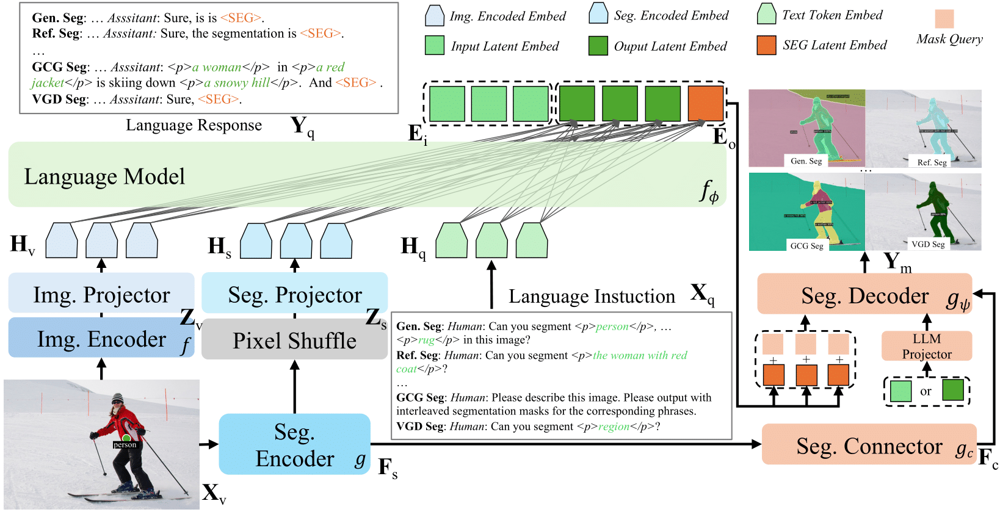

<div align="center">
<h1>X-SAM </h1>
<h3>From Segment Anything to Any Segmentation</h3>

[Hao Wang](https://github.com/wanghao9610)<sup>1,2</sup>,[Limeng Qiao](https://scholar.google.com/citations?user=3PFZAg0AAAAJ&hl=en)<sup>3</sup>,[Zequn Jie](https://scholar.google.com/citations?user=4sKGNB0AAAAJ&hl)<sup>3</sup>, [Zhijian Huang](https://zhijian11.github.io/)<sup>1</sup>, [Chengjian Feng](https://fcjian.github.io/)<sup>3</sup>, 

[Qingfang Zheng](https://openreview.net/profile?id=%7EZheng_Qingfang1)<sup>1</sup>, [Lin Ma](https://forestlinma.com/)<sup>3</sup>, [Xiangyuan Lan](https://scholar.google.com/citations?user=c3iwWRcAAAAJ&hl)<sup>2</sup><sup>:email:</sup>, [Xiaodan Liang](https://scholar.google.com/citations?user=voxznZAAAAAJ&hl)<sup>1,2</sup><sup>:email:</sup>

<sup>1</sup> Sun Yat-sen University, <sup>2</sup> Pengcheng Lab, <sup>3</sup> Meituan Inc

<sup>:email:</sup> Corresponding author.
</div>

<div align="center" style="display: flex; justify-content: center; align-items: center;">
  <a href="" style="margin: 0 2px;">
    
  </a>
  <a href='' style="margin: 0 2px;">
    
  </a>
  <a href="https://github.com/wanghao9610/X-SAM" style="margin: 0 2px;">
    
  </a>
  <a href="http://47.115.200.157:7861" style="margin: 0 2px;">
    
  </a>
  <a href='https://wanghao9610.github.io/X-SAM/' style="margin: 0 2px;">
    
  </a>
</div>

## :fire: Updates
- **`2025-07-24`**: We release the [Demo](http://47.115.200.157:7861) of X-SAM.

## :rocket: Introduction
This project provides the official PyTorch implementation, pre-trained models, training code, and demo code of X-SAM.

* X-SAM is novel unified segmentation MLLMs, which offers superior performance on all image segmentation benchmarks.

* X-SAM integrates the SAM into MLLMs via a unified formulation adapted to all image segmentation, extending the SAM's capability from *segment anything* to *any segmentation*.

* X-SAM co-trains on multi data sources via a effective multi-stage training strategy, achieving the robust performance across all tasks.

This project provides awesome code for the research of segmentation MLLMs:
* Training code for segmentation MLLMs.
* Evaluation code for all image segmentation benchmarks.
* Visualization code for segmentation MLLMs.
* Training code for LLaVA-based MLLMs (based on [XTuner](https://github.com/InternLM/xtuner)).
* Evaluation code for all VLM benchmarks (based on [VLMEvalKit](https://github.com/open-compass/VLMEvalKit)).

**NOTE:**

* If you have any questions, please feel free to open an issue.
* If this project gets over 500 🌟, we’ll release all code ASAP.

## :page_facing_up: Overview



## :bar_chart: Benchmark Results

Please refer to the [benchmark results](docs/benchmark_results.md) for more details.

## :white_check_mark: TODO
- [x] Release the [Demo](http://47.115.200.157:7861).
- [ ] Release the [weight](https://huggingface.co/wanghao9610/X-SAM).
- [ ] Release the code and instructions for demo.
- [ ] Release the code for evaluation on all segmentation benchmarks.
- [ ] Release the code for evaluation on all VLM Benchmarks.
- [ ] Release the code for training LLaVA-based MLLMs.
- [ ] Release the code for training X-SAM.

## :blush: Acknowledge

This project has referenced some excellent open-sourced repositories: [xtuner](https://github.com/InternLM/xtuner), [VLMEvalKit](https://github.com/open-compass/VLMEvalKit), [Sa2VA](https://github.com/magic-research/Sa2VA). Thanks for their wonderful works and contributions to the community.

## :pushpin: Citation
If you find X-SAM helpful for your research or applications, please consider giving us a star 🌟 and citing it using the following BibTeX entry.

```bibtex

```
