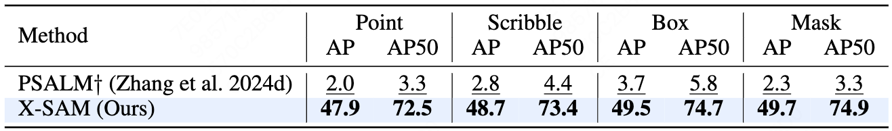
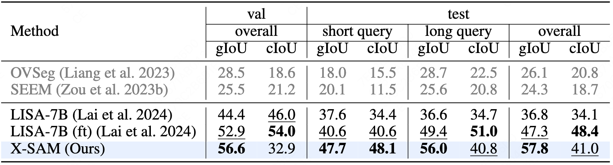

# :bar_chart: Benchmarks

## Segmentation Benchmarks
### Overall Performance

### Referring Segmentation

### Grounded COnversation Generation(GCG) Segmentation

### Visual GrounDed(VGD) Segmentation

### Generic Segmentation(Panoptic, Instance, Semantic)

### Open-Vocabulary(OV) Segmentation

### Reasoning Segmentation

### Interactive Segmentation

## Conversation Benchmarks
### Image Conversation

